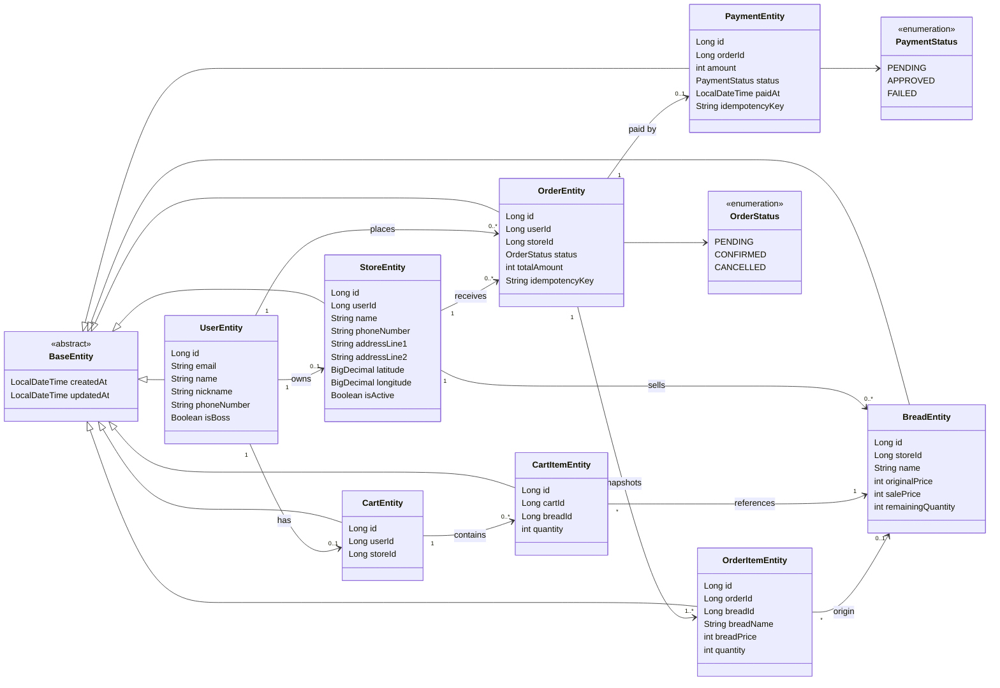

# 클래스 다이어그램

이 문서는 커머스 코어 도메인 기준으로 주요 엔티티 관계를 한 번에 보기 위한 Mermaid 클래스 다이어그램입니다.

현재 소스는 JPA 객체 연관관계보다 `Long` FK 필드 중심으로 작성되어 있으므로, 아래 다이어그램은 엔티티 필드와 DB 스키마를 기준으로 한 "논리적 관계"를 표현합니다.

## Commerce Core

## 읽는 포인트

- `StoreEntity.userId` 때문에 한 명의 사장님은 최대 한 개의 가게를 가집니다.
- `CartEntity.storeId` 때문에 장바구니는 한 시점에 하나의 매장 빵만 담도록 설계되어 있습니다.
- `OrderItemEntity`는 주문 시점의 `breadName`, `breadPrice`를 별도로 저장하는 스냅샷 엔티티입니다.
- `PaymentEntity.orderId`가 unique라서 주문 하나당 결제는 최대 하나입니다.

## 기준 파일

- `src/main/java/com/todaybread/server/domain/user/entity/UserEntity.java`
- `src/main/java/com/todaybread/server/domain/store/entity/StoreEntity.java`
- `src/main/java/com/todaybread/server/domain/bread/entity/BreadEntity.java`
- `src/main/java/com/todaybread/server/domain/cart/entity/CartEntity.java`
- `src/main/java/com/todaybread/server/domain/cart/entity/CartItemEntity.java`
- `src/main/java/com/todaybread/server/domain/order/entity/OrderEntity.java`
- `src/main/java/com/todaybread/server/domain/order/entity/OrderItemEntity.java`
- `src/main/java/com/todaybread/server/domain/payment/entity/PaymentEntity.java`
- `src/main/resources/db/migration/V1__init_schema.sql`
