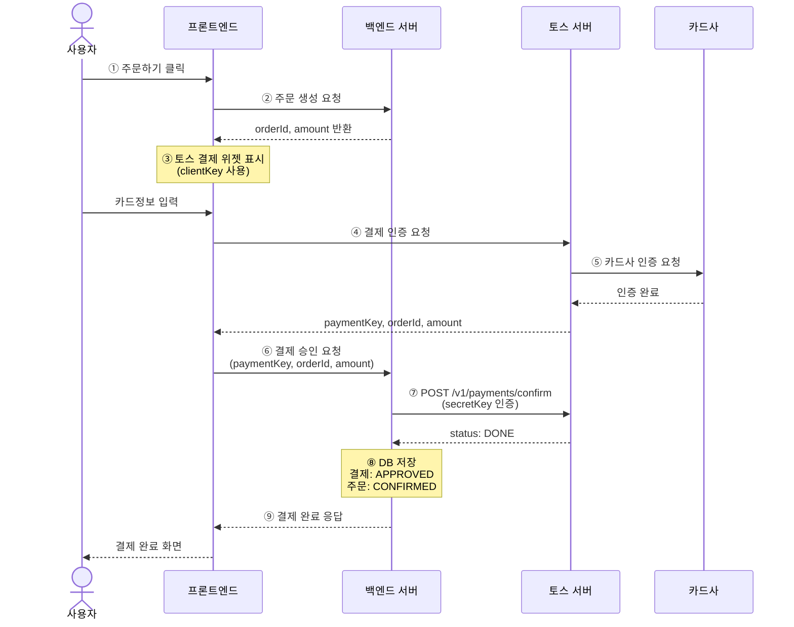

# 토스 페이먼츠 연동 가이드

> 토스 페이먼츠 공식 문서: [https://docs.tosspayments.com/guides/v2/get-started/llms-guide](https://docs.tosspayments.com/guides/v2/get-started/llms-guide)

이 문서는 todaybread 프로젝트의 토스 페이먼츠 결제 연동에 대한 전체 가이드입니다.

---

## 1. 결제 전체 흐름

토스 페이먼츠 결제는 **요청 → 인증 → 승인** 3단계로 진행됩니다.



### 왜 요청과 승인을 분리하나요?

- **보안**: Secret Key는 서버에만 있어야 하므로 승인은 반드시 백엔드에서 처리
- **금액 검증**: 프론트에서 금액이 위변조될 수 있으므로 서버에서 주문 금액과 대조
- **데이터 정합성**: 동기적으로 승인 결과를 받아 DB에 저장하므로 웹훅 없이도 정합성 보장

---

## 2. 키와 식별자 설명

토스 결제 연동에는 여러 종류의 키와 식별자가 사용됩니다. 각각의 역할을 정리합니다.

### API 키 (토스 개발자 센터에서 발급)

| 키 | 형식 | 어디서 사용 | 역할 |
|----|------|------------|------|
| **Client Key** | `test_ck_...` / `live_ck_...` | 프론트엔드 | 토스 SDK 초기화 시 사용. 공개 키이므로 노출돼도 안전 |
| **Secret Key** | `test_sk_...` / `live_sk_...` | 백엔드 | 토스 API 호출 시 인증 헤더에 포함. **절대 프론트에 노출 금지** |

- Client Key와 Secret Key는 **쌍**으로 발급됨. 반드시 같은 쌍을 사용해야 함
- `test_` 접두사 = 테스트 모드 (돈 안 빠짐), `live_` 접두사 = 라이브 모드 (실제 결제)
- 두 모드의 API 엔드포인트, 요청/응답 형식은 **완전히 동일**. 키만 다름

### 결제 식별자

| 식별자 | 누가 만드는지 | 형식 | 역할 |
|--------|-------------|------|------|
| **orderId** | 프론트엔드 (백엔드 DB ID 기반) | `order_{DB주문ID}` (6~64자, 영문/숫자/`-`/`_`) | 주문을 식별하는 값. 토스 SDK 결제 요청 시 전달하고, 승인 시에도 동일한 값 사용 |
| **paymentKey** | 토스 서버 | `tgen_...` 또는 `tviva...` | 결제 건마다 토스가 발급하는 고유 키. 결제 인증 완료 후 프론트에 콜백으로 전달됨. 승인/취소/조회에 필수 |
| **Idempotency-Key** | 프론트엔드 | UUID v4 권장 | 같은 결제 요청이 중복 처리되는 걸 방지. 같은 키로 재요청하면 기존 결과 반환 |

### orderId 형식 주의사항

> ⚠️ 토스 API의 `orderId`는 **6자 이상 64자 이하** 영문 대소문자, 숫자, `-`, `_` 문자열이어야 합니다.

이 프로젝트에서는 DB의 숫자 주문 ID에 `order_` 접두사를 붙여서 토스에 전달합니다:
- DB 주문 ID: `110` → 토스 orderId: `order_110`
- 프론트에서 토스 SDK 결제 요청 시에도 `"order_" + orderId` 형식을 사용해야 합니다

### paymentKey는 왜 필요한가요?

`paymentKey`는 토스가 결제 건마다 발급하는 고유 식별자입니다:
- 프론트에서 토스 결제 위젯으로 사용자가 카드 정보를 입력하고 인증을 완료하면 토스가 `paymentKey`를 발급
- 이 값을 백엔드로 보내면 백엔드가 Secret Key와 함께 토스 Confirm API를 호출해서 결제를 최종 확정
- 결제 승인, 취소, 조회 시 모두 `paymentKey`가 필요하므로 DB에 반드시 저장
- `paymentKey`는 외부에 노출돼도 안전 (Secret Key 없이는 API 호출 불가)

### Secret Key 인증 방식

백엔드에서 토스 API를 호출할 때 Secret Key를 아래 형식으로 인코딩해서 HTTP 헤더에 포함합니다:

```
1. Secret Key 뒤에 콜론(:) 추가: "test_sk_xxx:"
2. Base64 인코딩: Base64("test_sk_xxx:")
3. HTTP 헤더: Authorization: Basic {인코딩된값}
```

---

## 3. SDK v1 vs v2 차이점

> **핵심: v1/v2는 프론트엔드 SDK 버전이지, 백엔드 API 버전이 아닙니다.**
> 백엔드 API는 v1/v2 관계없이 동일하게 `/v1/payments/confirm`을 사용합니다.

| 항목 | SDK v1 | SDK v2 |
|------|--------|--------|
| **SDK 파일** | 결제위젯, 브랜드페이, 결제창 각각 별도 3개 | 하나의 통합 SDK (`v2/standard`) |
| **스크립트 로드** | `v1/payment-widget`, `v1/brandpay`, `v1/payment` 3개 | `v2/standard` 1개 |
| **초기화** | `PaymentWidget()`, `BrandPay()`, `TossPayments()` 각각 | `TossPayments()` 하나로 통합 |
| **결제수단 지원** | 카드, 간편결제, 계좌이체, 가상계좌, 휴대폰, 상품권 | 동일 |
| **결제 UI** | 동일 | 동일 (SDK v2는 연동 편의만 개선) |
| **백엔드 API** | `/v1/payments/confirm` | **동일** — `/v1/payments/confirm` |
| **API 키** | 동일 | 동일 (v1 키를 v2에서 그대로 사용 가능) |
| **모바일 SDK** | React Native, Flutter 지원 | 아직 미지원 (출시 전까지 v1 사용) |

### SDK v2 (권장)

```html
<head>
  <script src="https://js.tosspayments.com/v2/standard"></script>
</head>
<script>
  const tosspayments = TossPayments(clientKey);
  const widgets = tosspayments.widgets({ customerKey });
</script>
```

### v2 주요 변경사항

- `renderPaymentMethods()`가 비동기로 변경
- `updateAmount()` → `setAmount()`로 대체
- `on('ready')` 이벤트 제거, `on('paymentMethodSelect')` 추가
- `destroy()` 메서드 추가 (결제 UI 인스턴스 삭제)
- 결제창 `requestPayment(결제수단, 결제정보)` → `requestPayment(결제정보)` 통합

---

## 4. 프론트엔드에서 하는 일

프론트엔드는 토스 SDK를 사용하여 결제 UI를 띄우고, 결제 인증 결과를 백엔드에 전달합니다.

### 필요한 작업

1. **토스 SDK 로드**: `<script src="https://js.tosspayments.com/v2/standard"></script>`
2. **Client Key 조회**: `GET /api/payments/client-key` → `{"clientKey": "test_ck_..."}`
3. **결제 위젯 초기화**: `TossPayments(clientKey).widgets({ customerKey })`
4. **결제 금액 설정**: `widgets.setAmount({ value: 금액, currency: "KRW" })`
5. **결제 UI 렌더링**: `widgets.renderPaymentMethods({ selector: "#payment-methods" })`
6. **결제 요청**: `widgets.requestPayment({ orderId: "order_" + 주문ID, ... })` → 성공 시 `successUrl`로 리다이렉트
7. **승인 요청**: 성공 URL에서 받은 `paymentKey`, `orderId`, `amount`를 백엔드로 전송
   - `POST /api/payments/confirm` + `Idempotency-Key` 헤더
8. **결과 표시**: 백엔드 응답에 따라 성공/실패 화면 표시

> ⚠️ 6번에서 `orderId`는 반드시 `"order_" + 주문ID` 형식이어야 합니다 (토스 규격: 6~64자)

---

## 5. 백엔드에서 하는 일

백엔드는 토스 API와 직접 통신하여 결제를 승인/취소하고, 결제 정보를 DB에 저장합니다.

### API 엔드포인트

| 메서드 | 경로 | 인증 | 설명 |
|--------|------|------|------|
| `GET` | `/api/payments/client-key` | X | 토스 Client Key 조회 (프론트용) |
| `POST` | `/api/payments/confirm` | O | 결제 승인 확정 (Idempotency-Key 필수) |
| `POST` | `/api/orders/{orderId}/cancel` | O | 주문 취소 (CONFIRMED 상태면 결제 취소 포함) |

### 핵심 컴포넌트

```
PaymentController
  ├── POST /api/payments/confirm → PaymentService.confirmPayment()
  └── GET /api/payments/client-key → TossPaymentProperties.clientKey()

PaymentService
  ├── confirmPayment() → 멱등성 체크 → 주문 검증 → PaymentProcessor.confirm() → DB 저장
  └── cancelPayment() → 결제 조회 → PaymentProcessor.cancel() → DB 저장

TossPaymentProcessor (Profile: !stub)
  ├── confirm() → TossPaymentClient.confirmPayment()
  └── cancel() → TossPaymentClient.cancelPayment()

StubPaymentProcessor (Profile: stub)
  └── pay() → 가짜 결제 성공 반환 (로컬 개발용)

TossPaymentClient
  ├── confirmPayment() → POST /v1/payments/confirm (토스 API)
  └── cancelPayment() → POST /v1/payments/{paymentKey}/cancel (토스 API)
```

### 결제 상태

| 상태 | 설명 |
|------|------|
| `PENDING` | 결제 대기 (주문 생성 직후) |
| `APPROVED` | 결제 승인 완료 |
| `FAILED` | 결제 실패 |
| `CANCELLED` | 결제 취소 (환불 완료) |

---

## 6. 키 관리 및 환경별 설정

### `.env` 설정

```bash
# 개발 환경 (테스트 키)
TOSS_SECRET_KEY=test_sk_발급받은키
TOSS_CLIENT_KEY=test_ck_발급받은키

# 운영 환경 (라이브 키) — 배포 시 이 값으로 교체
# TOSS_SECRET_KEY=live_sk_발급받은키
# TOSS_CLIENT_KEY=live_ck_발급받은키
```

> ⚠️ `.env` 파일은 `.gitignore`에 포함되어 Git에 커밋되지 않습니다.
> 운영 서버에서는 환경 변수로 직접 설정하거나 CI/CD 시크릿으로 관리하세요.

### `application.properties`

```properties
toss.payment.secret-key=${TOSS_SECRET_KEY:}
toss.payment.client-key=${TOSS_CLIENT_KEY:}
toss.payment.base-url=https://api.tosspayments.com
```

`${TOSS_SECRET_KEY:}`는 OS 환경 변수를 읽는 문법입니다. `.env` 파일을 직접 읽는 게 아니라 시스템에 설정된 환경 변수를 가져옵니다.

### 인텔리제이에서 `.env` 파일 로드

1. **Run → Edit Configurations** → `ServerApplication` 선택
2. **Environment variables** 옆 `...` 버튼 클릭
3. **Load variables from file** 체크 → `.env` 파일 선택
4. **Apply → OK**

### Spring Profile 기반 결제 처리기 전환

| 환경 | 프로필 | 결제 처리기 | 토스 키 필요 | 설명 |
|------|--------|------------|-------------|------|
| 로컬 개발 (키 없음) | `stub` | `StubPaymentProcessor` | ❌ | 가짜 결제 성공 반환 |
| 개발/QA (테스트 키) | 기본 | `TossPaymentProcessor` | ✅ 테스트 키 | 토스 API 호출, 돈 안 빠짐 |
| 운영 (라이브 키) | 기본 | `TossPaymentProcessor` | ✅ 라이브 키 | 토스 API 호출, 실제 결제 |

```bash
# stub 모드 (키 없이 개발)
SPRING_PROFILES_ACTIVE=stub ./gradlew bootRun

# 토스 연동 모드 (.env에 키 설정 후)
./gradlew bootRun
```

---

## 7. 테스트 스크립트

### stub 모드 (가짜 결제, 키 불필요)

```bash
./scripts/test-order.sh
```

로그인 → Client Key 조회 → 주문 생성 → 결제 → 주문 확인 → 주문 취소까지 자동 실행.

### 토스 연동 모드 (실제 토스 API 호출)

```bash
./scripts/test-order.sh --toss
```

로그인 → Client Key 조회 → 주문 생성까지 자동 실행 후, confirm API 호출용 curl 명령어를 출력합니다.
`paymentKey`는 프론트엔드 토스 SDK를 통해서만 발급받을 수 있으므로, 수동으로 입력해야 합니다.

---

## 8. 토스 페이먼츠 MCP 서버

AI 개발 도구(Kiro, Cursor 등)에서 토스 페이먼츠 연동 문서를 참조할 수 있는 MCP 서버입니다.

### 설정 (`.kiro/settings/mcp.json`)

```json
{
  "mcpServers": {
    "tosspayments-integration-guide": {
      "command": "npx",
      "args": ["-y", "@tosspayments/integration-guide-mcp@latest"]
    }
  }
}
```

### 제공 도구

| 도구 | 설명 |
|------|------|
| `get-v2-documents` | 토스 페이먼츠 v2 문서 조회 (기본) |
| `get-v1-documents` | 토스 페이먼츠 v1 문서 조회 (명시적 요청 시) |
| `get-glossary-documents` | 용어/정책/백서 문서 조회 |
| `document-by-id` | 문서 ID로 전체 내용 조회 |

---

## 9. 참고 링크

- [토스 페이먼츠 개발자 센터](https://developers.tosspayments.com)
- [토스 페이먼츠 LLM 연동 가이드](https://docs.tosspayments.com/guides/v2/get-started/llms-guide)
- [결제 흐름 이해하기](https://docs.tosspayments.com/guides/v2/get-started/payment-flow)
- [SDK v1 → v2 마이그레이션](https://docs.tosspayments.com/guides/v2/get-started/migration)
- [API 레퍼런스](https://docs.tosspayments.com/reference)
- [샌드박스 (테스트 결제)](https://docs.tosspayments.com/reference/test)
- [에러 코드 목록](https://docs.tosspayments.com/reference/error-codes)
